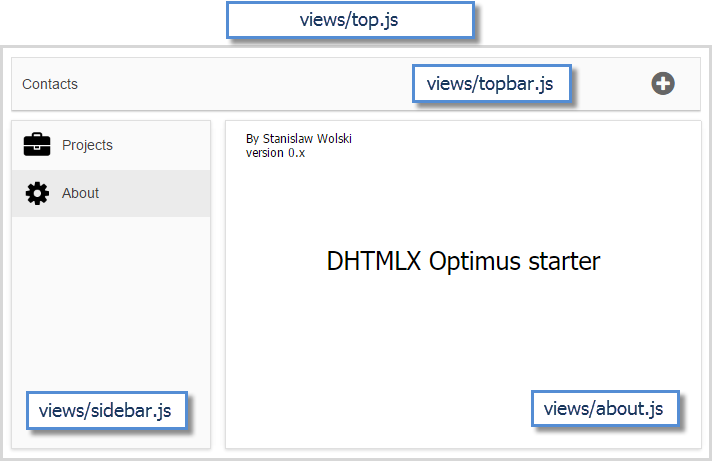
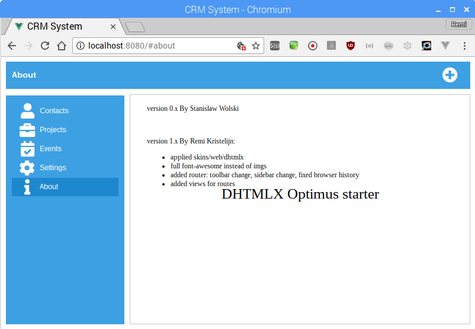
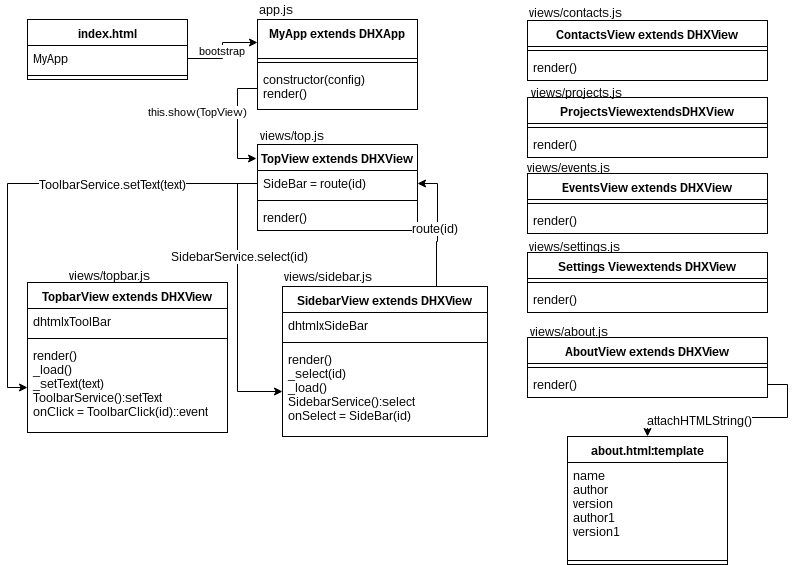

DHTMLX Optimus - starter
-------------------------

Note: this is a form from [DHTMLX/optimus-start](https://github.com/DHTMLX/optimus-start) however with some additions:

1. updated all dependencies [Per pull request](https://github.com/DHTMLX/optimus-start/pull/1)
See [below](#solved-security-issues) for more information.
2. Added front-end router and more views, ability to hit F5 and stay on same view, and have an url that you can share
3. Replaced all images with [Font Awesome](http://fontawesome.com/icons?d=gallery)
4. Fixed interaction between different components using events and services

What I started with:


What I ended up with:





# How to run standalone

```
npm install
npm run server
```

After that, open http://localhost:8080 in the browser


# How to run with Apache

```
npm install
npm run watch
```


# More NPM commands

- `npm run codebase` - rebuilds js file in codebase folder
- `npm run lint` - check codebase
- `npm run build` - build standalone package
- `npm run deploy` - deploy to live server

# Additions for this version

More information:

[DHTMLX.com](https://docs.dhtmlx.com/optimus__index.html)

# Todo
- create diagram to get an overview how cross-component-communication works, up: events, down: services
- make the Contacts grid work

# Solved security issues

After running `npm install` you get confronted with the following:

```bash
pi@raspberry:~/optimus-start $ npm i
npm WARN deprecated babel-preset-es2015@6.24.1: 🙌  Thanks for using Babel: we recommend using babel-preset-env now: please read babeljs.io/env to update! 
npm WARN deprecated gulp-util@3.0.8: gulp-util is deprecated - replace it, following the guidelines at https://medium.com/gulpjs/gulp-util-ca3b1f9f9ac5
npm WARN deprecated gulp-util@2.2.20: gulp-util is deprecated - replace it, following the guidelines at https://medium.com/gulpjs/gulp-util-ca3b1f9f9ac5
npm WARN deprecated graceful-fs@3.0.11: please upgrade to graceful-fs 4 for compatibility with current and future versions of Node.js
npm WARN deprecated minimatch@2.0.10: Please update to minimatch 3.0.2 or higher to avoid a RegExp DoS issue
npm WARN deprecated minimatch@0.2.14: Please update to minimatch 3.0.2 or higher to avoid a RegExp DoS issue
npm WARN deprecated graceful-fs@1.2.3: please upgrade to graceful-fs 4 for compatibility with current and future versions of Node.js
npm notice created a lockfile as package-lock.json. You should commit this file.
npm WARN optimus-start@1.0.0 scripts['server'] should probably be scripts['start'].
npm WARN optional SKIPPING OPTIONAL DEPENDENCY: fsevents@1.2.4 (node_modules/fsevents):
npm WARN notsup SKIPPING OPTIONAL DEPENDENCY: Unsupported platform for fsevents@1.2.4: wanted {"os":"darwin","arch":"any"} (current: {"os":"linux","arch":"ia32"})

added 1101 packages from 686 contributors and audited 9514 packages in 40.708s
found 12 vulnerabilities (3 low, 5 moderate, 4 high)
  run `npm audit fix` to fix them, or `npm audit` for details
pi@raspberry:~/optimus-start $ npm audit
                                                                                
                       === npm audit security report ===                        
                                                                                
# Run  npm install --save-dev gulp@4.0.0  to resolve 5 vulnerabilities
SEMVER WARNING: Recommended action is a potentially breaking change
┌───────────────┬──────────────────────────────────────────────────────────────┐
│ Low           │ Prototype Pollution                                          │
├───────────────┼──────────────────────────────────────────────────────────────┤
│ Package       │ lodash                                                       │
├───────────────┼──────────────────────────────────────────────────────────────┤
│ Dependency of │ gulp [dev]                                                   │
├───────────────┼──────────────────────────────────────────────────────────────┤
│ Path          │ gulp > vinyl-fs > glob-watcher > gaze > globule > lodash     │
├───────────────┼──────────────────────────────────────────────────────────────┤
│ More info     │ https://nodesecurity.io/advisories/577                       │
└───────────────┴──────────────────────────────────────────────────────────────┘


┌───────────────┬──────────────────────────────────────────────────────────────┐
│ High          │ Regular Expression Denial of Service                         │
├───────────────┼──────────────────────────────────────────────────────────────┤
│ Package       │ minimatch                                                    │
├───────────────┼──────────────────────────────────────────────────────────────┤
│ Dependency of │ gulp [dev]                                                   │
├───────────────┼──────────────────────────────────────────────────────────────┤
│ Path          │ gulp > vinyl-fs > glob-stream > glob > minimatch             │
├───────────────┼──────────────────────────────────────────────────────────────┤
│ More info     │ https://nodesecurity.io/advisories/118                       │
└───────────────┴──────────────────────────────────────────────────────────────┘


┌───────────────┬──────────────────────────────────────────────────────────────┐
│ High          │ Regular Expression Denial of Service                         │
├───────────────┼──────────────────────────────────────────────────────────────┤
│ Package       │ minimatch                                                    │
├───────────────┼──────────────────────────────────────────────────────────────┤
│ Dependency of │ gulp [dev]                                                   │
├───────────────┼──────────────────────────────────────────────────────────────┤
│ Path          │ gulp > vinyl-fs > glob-stream > minimatch                    │
├───────────────┼──────────────────────────────────────────────────────────────┤
│ More info     │ https://nodesecurity.io/advisories/118                       │
└───────────────┴──────────────────────────────────────────────────────────────┘


┌───────────────┬──────────────────────────────────────────────────────────────┐
│ High          │ Regular Expression Denial of Service                         │
├───────────────┼──────────────────────────────────────────────────────────────┤
│ Package       │ minimatch                                                    │
├───────────────┼──────────────────────────────────────────────────────────────┤
│ Dependency of │ gulp [dev]                                                   │
├───────────────┼──────────────────────────────────────────────────────────────┤
│ Path          │ gulp > vinyl-fs > glob-watcher > gaze > globule > glob >     │
│               │ minimatch                                                    │
├───────────────┼──────────────────────────────────────────────────────────────┤
│ More info     │ https://nodesecurity.io/advisories/118                       │
└───────────────┴──────────────────────────────────────────────────────────────┘


┌───────────────┬──────────────────────────────────────────────────────────────┐
│ High          │ Regular Expression Denial of Service                         │
├───────────────┼──────────────────────────────────────────────────────────────┤
│ Package       │ minimatch                                                    │
├───────────────┼──────────────────────────────────────────────────────────────┤
│ Dependency of │ gulp [dev]                                                   │
├───────────────┼──────────────────────────────────────────────────────────────┤
│ Path          │ gulp > vinyl-fs > glob-watcher > gaze > globule > minimatch  │
├───────────────┼──────────────────────────────────────────────────────────────┤
│ More info     │ https://nodesecurity.io/advisories/118                       │
└───────────────┴──────────────────────────────────────────────────────────────┘


# Run  npm install --save-dev less@3.0.4  to resolve 4 vulnerabilities
SEMVER WARNING: Recommended action is a potentially breaking change
┌───────────────┬──────────────────────────────────────────────────────────────┐
│ Moderate      │ Prototype pollution                                          │
├───────────────┼──────────────────────────────────────────────────────────────┤
│ Package       │ hoek                                                         │
├───────────────┼──────────────────────────────────────────────────────────────┤
│ Dependency of │ less [dev]                                                   │
├───────────────┼──────────────────────────────────────────────────────────────┤
│ Path          │ less > request > hawk > boom > hoek                          │
├───────────────┼──────────────────────────────────────────────────────────────┤
│ More info     │ https://nodesecurity.io/advisories/566                       │
└───────────────┴──────────────────────────────────────────────────────────────┘


┌───────────────┬──────────────────────────────────────────────────────────────┐
│ Moderate      │ Prototype pollution                                          │
├───────────────┼──────────────────────────────────────────────────────────────┤
│ Package       │ hoek                                                         │
├───────────────┼──────────────────────────────────────────────────────────────┤
│ Dependency of │ less [dev]                                                   │
├───────────────┼──────────────────────────────────────────────────────────────┤
│ Path          │ less > request > hawk > cryptiles > boom > hoek              │
├───────────────┼──────────────────────────────────────────────────────────────┤
│ More info     │ https://nodesecurity.io/advisories/566                       │
└───────────────┴──────────────────────────────────────────────────────────────┘


┌───────────────┬──────────────────────────────────────────────────────────────┐
│ Moderate      │ Prototype pollution                                          │
├───────────────┼──────────────────────────────────────────────────────────────┤
│ Package       │ hoek                                                         │
├───────────────┼──────────────────────────────────────────────────────────────┤
│ Dependency of │ less [dev]                                                   │
├───────────────┼──────────────────────────────────────────────────────────────┤
│ Path          │ less > request > hawk > hoek                                 │
├───────────────┼──────────────────────────────────────────────────────────────┤
│ More info     │ https://nodesecurity.io/advisories/566                       │
└───────────────┴──────────────────────────────────────────────────────────────┘


┌───────────────┬──────────────────────────────────────────────────────────────┐
│ Moderate      │ Prototype pollution                                          │
├───────────────┼──────────────────────────────────────────────────────────────┤
│ Package       │ hoek                                                         │
├───────────────┼──────────────────────────────────────────────────────────────┤
│ Dependency of │ less [dev]                                                   │
├───────────────┼──────────────────────────────────────────────────────────────┤
│ Path          │ less > request > hawk > sntp > hoek                          │
├───────────────┼──────────────────────────────────────────────────────────────┤
│ More info     │ https://nodesecurity.io/advisories/566                       │
└───────────────┴──────────────────────────────────────────────────────────────┘


# Run  npm install --save-dev webpack-livereload-plugin@2.1.1  to resolve 2 vulnerabilities
SEMVER WARNING: Recommended action is a potentially breaking change
┌───────────────┬──────────────────────────────────────────────────────────────┐
│ Low           │ Regular Expression Denial of Service                         │
├───────────────┼──────────────────────────────────────────────────────────────┤
│ Package       │ debug                                                        │
├───────────────┼──────────────────────────────────────────────────────────────┤
│ Dependency of │ webpack-livereload-plugin [dev]                              │
├───────────────┼──────────────────────────────────────────────────────────────┤
│ Path          │ webpack-livereload-plugin > tiny-lr > body-parser > debug    │
├───────────────┼──────────────────────────────────────────────────────────────┤
│ More info     │ https://nodesecurity.io/advisories/534                       │
└───────────────┴──────────────────────────────────────────────────────────────┘


┌───────────────┬──────────────────────────────────────────────────────────────┐
│ Low           │ Regular Expression Denial of Service                         │
├───────────────┼──────────────────────────────────────────────────────────────┤
│ Package       │ debug                                                        │
├───────────────┼──────────────────────────────────────────────────────────────┤
│ Dependency of │ webpack-livereload-plugin [dev]                              │
├───────────────┼──────────────────────────────────────────────────────────────┤
│ Path          │ webpack-livereload-plugin > tiny-lr > debug                  │
├───────────────┼──────────────────────────────────────────────────────────────┤
│ More info     │ https://nodesecurity.io/advisories/534                       │
└───────────────┴──────────────────────────────────────────────────────────────┘


# Run  npm install --save-dev url-loader@1.0.1  to resolve 1 vulnerability
SEMVER WARNING: Recommended action is a potentially breaking change
┌───────────────┬──────────────────────────────────────────────────────────────┐
│ Moderate      │ Regular Expression Denial of Service                         │
├───────────────┼──────────────────────────────────────────────────────────────┤
│ Package       │ mime                                                         │
├───────────────┼──────────────────────────────────────────────────────────────┤
│ Dependency of │ url-loader [dev]                                             │
├───────────────┼──────────────────────────────────────────────────────────────┤
│ Path          │ url-loader > mime                                            │
├───────────────┼──────────────────────────────────────────────────────────────┤
│ More info     │ https://nodesecurity.io/advisories/535                       │
└───────────────┴──────────────────────────────────────────────────────────────┘


found 12 vulnerabilities (3 low, 5 moderate, 4 high) in 9514 scanned packages
  12 vulnerabilities require semver-major dependency updates.

pi@raspberry:~/optimus-start $ npm outdated
Package                      Current  Wanted   Latest  Location
babel-loader                   6.4.1   6.4.1    7.1.4  optimus-start
css-loader                    0.27.3  0.27.3  0.28.11  optimus-start
dhx-optimus                    0.3.0   0.3.0    0.4.0  optimus-start
eslint                        3.19.0  3.19.0   4.19.1  optimus-start
extract-text-webpack-plugin    2.1.2   2.1.2    3.0.2  optimus-start
file-loader                   0.10.1  0.10.1   1.1.11  optimus-start
gulp-clean                     0.3.2   0.3.2    0.4.0  optimus-start
gulp-eslint                    3.0.1   3.0.1    4.0.2  optimus-start
gulp-replace                   0.5.4   0.5.4    1.0.0  optimus-start
gulp-uglify                    2.1.2   2.1.2    3.0.0  optimus-start
less                           2.7.3   2.7.3    3.0.4  optimus-start
less-loader                    3.0.0   3.0.0    4.1.0  optimus-start
url-loader                     0.5.9   0.5.9    1.0.1  optimus-start
webpack                        2.7.0   2.7.0   4.12.0  optimus-start
webpack-dev-server            2.11.2  2.11.2    3.1.4  optimus-start
webpack-livereload-plugin     0.10.0  0.10.0    2.1.1  optimus-start
webpack-stream                 3.2.0   3.2.0    4.0.3  optimus-start
```
This is simple to overcome:

- update all packages to the latest, except for `extract-text-webpack-plugin` and `gulp`, update them to `@next`

`npm i --save-dev babel-loader@latest css-loader@latest dhx-optimus@latest eslint@latest file-uploader@latest gulp-clean@latest gulp-eslint@latest gulp-replace@latest gulp-uglify@latest less@latest less-loader@latest url-loader@latest webpack@latest webpack-dev-server@latest webpack-livereload-plugin@latest webpack-stream@latest extract-text-webpack-plugin@next gulp@next`

After that you will see the following in package.json
```json
/// ---
"devDependencies": {
    "babel-core": "^6.24.0",
    "babel-loader": "^7.1.4",
    "babel-preset-es2015": "^6.24.0",
    "babel-preset-es2015-loose": "^8.0.0",
    "css-loader": "^0.28.11",
    "dhx-optimus": "^0.4.0",
    "eslint": "^4.19.1",
    "event-stream": "^3.3.4",
    "extract-text-webpack-plugin": "^4.0.0-beta.0",
    "file-loader": "^1.1.11",
    "gulp": "^4.0.0",
    "gulp-clean": "^0.4.0",
    "gulp-cssnano": "^2.1.2",
    "gulp-eslint": "^4.0.2",
    "gulp-filter": "^5.0.0",
    "gulp-rename": "^1.2.2",
    "gulp-replace": "^1.0.0",
    "gulp-uglify": "^3.0.0",
    "gulp-util": "^3.0.8",
    "handlebars": "^4.0.6",
    "handlebars-loader": "^1.4.0",
    "less": "^3.0.4",
    "less-loader": "^4.1.0",
    "url-loader": "^1.0.1",
    "webpack": "^4.12.0",
    "webpack-cli": "^3.0.8",
    "webpack-dev-server": "^3.1.4",
    "webpack-livereload-plugin": "^2.1.1",
    "webpack-stream": "^4.0.3"
  },
/// ---

```

Because webpack is now on v4, you need to provide the type of environment you are running, so add 'development' to 

`webpack.config.js`

```javascript
var path = require("path");
var pkg = require("./package.json");

var ExtractTextPlugin = require("extract-text-webpack-plugin");
var LiveReloadPlugin = require('webpack-livereload-plugin');

var config = {
  entry: pkg.main,
  output: {
    path: path.join(__dirname, 'codebase'),
    publicPath:"/codebase/",
    filename: pkg.main
  },
  devtool: 'source-map',
  module: {
    rules: [
      {
        test: /\.js$/,
        use: 'babel-loader'
      },
      {
      	test: /\.(png|jpg|gif)$/,
      	use: 'url-loader?limit=25000'
      },
      {
        test: /\.less$/,
        use: ExtractTextPlugin.extract({
        	use: [
        		"css-loader",
				"less-loader"
			]
        })
      },
      {
        test: /\.html$/,
        use: "handlebars-loader"
      }
    ]
  },
  resolve: {
    extensions: ['.js'],
    modules: ["sources", "node_modules"]
  },
  devServer:{
    proxy: {
      '/server/*': pkg.localURL
    }
  },
  plugins: [
    new ExtractTextPlugin({
    	filename:pkg.main.replace(".js", ".css")
	}),
    new LiveReloadPlugin()
  ],                                   /* <<<<<<< don't forget to add comma */
  mode: 'development'                  /* <<<<<<< HERE */
};

module.exports = config;
```

